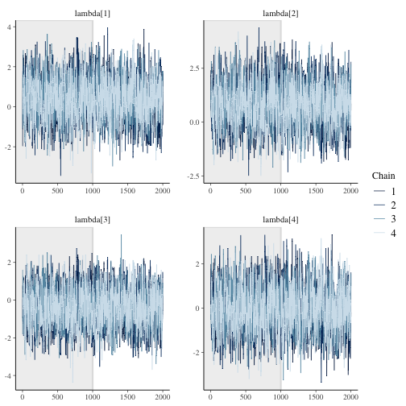
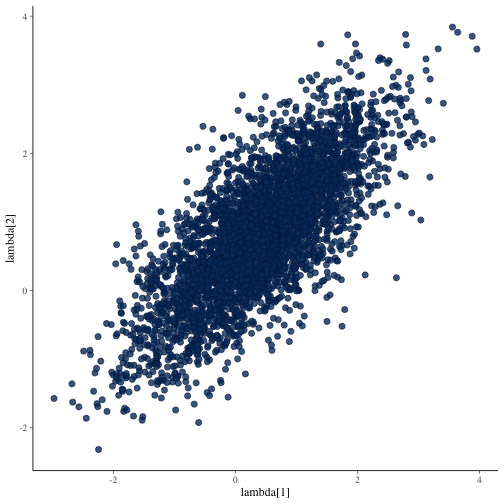
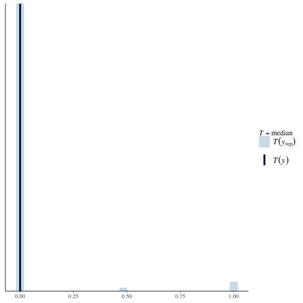
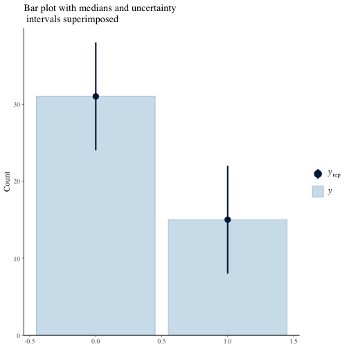
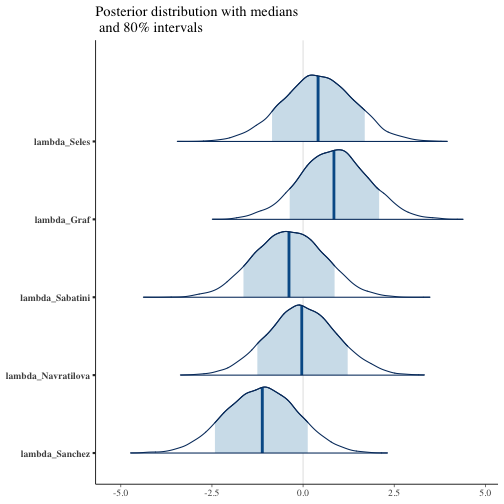
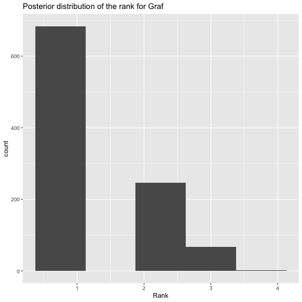

```r
library(bpcs)
library(tidyverse)
library(kableExtra)
library(bayesplot)
```

# Getting started
In this vignette, we provide an example of the usage of the `bpcs` package along with the core concepts to use the package.

## Installation
The package requires installation of the `rstan` package [@rstan]. For more details see the `REAMDE.md` document.

To install the latest version from Github:

```r
remotes::install_github('davidissamattos/bpcs')
```

After install we load the package with:

```r
library(bpcs)
```

## Introduction

The `bpcs` package performs Bayesian estimation of Paired Comparison models utilizing Stan. 
We provide a series of models and auxiliary functions to help in the analysis and evaluation of the models. However, this package have the philosophy of 'batteries not included' for plots, tables and data transformation. There are already many great packages capable of performing create high quality plots, tables and that provides tools for data transformation. Since each user can have their own preferences, customization needs and data cleaning and transformation workflows, we designed not to enforce any particular framework or package. Our functions were designed to return cleaned data frames that can be used almost directly, or with few transformations in those packages. 

With that said, we provide in the vignettes the code we use to transform the data and generate the tables and plots. The user is free to use/copy/modify these codes for their own use. For those we rely on the collection of packages `tidyverse` [@tidyverse2019], and the packages `knitr` [@knitr2014] and `kableExtra` [@kableExtra2020].


# The Bradley Terry model

# Tennis example

In this example, we will use the example from tennis players from Agresti [@agresti2003categorical]. The data `tennis_agresti` contains the information regarding tennis matches between 5 players, and how many times they won against each other.


```r
knitr::kable(tennis_agresti) %>% 
  kableExtra::kable_styling()
```

<table class="table" style="margin-left: auto; margin-right: auto;">
 <thead>
  <tr>
   <th style="text-align:left;"> player0 </th>
   <th style="text-align:left;"> player1 </th>
   <th style="text-align:right;"> wins_player0 </th>
   <th style="text-align:right;"> wins_player1 </th>
  </tr>
 </thead>
<tbody>
  <tr>
   <td style="text-align:left;"> Seles </td>
   <td style="text-align:left;"> Graf </td>
   <td style="text-align:right;"> 2 </td>
   <td style="text-align:right;"> 3 </td>
  </tr>
  <tr>
   <td style="text-align:left;"> Seles </td>
   <td style="text-align:left;"> Sabatini </td>
   <td style="text-align:right;"> 1 </td>
   <td style="text-align:right;"> 0 </td>
  </tr>
  <tr>
   <td style="text-align:left;"> Seles </td>
   <td style="text-align:left;"> Navratilova </td>
   <td style="text-align:right;"> 3 </td>
   <td style="text-align:right;"> 3 </td>
  </tr>
  <tr>
   <td style="text-align:left;"> Seles </td>
   <td style="text-align:left;"> Sanchez </td>
   <td style="text-align:right;"> 2 </td>
   <td style="text-align:right;"> 0 </td>
  </tr>
  <tr>
   <td style="text-align:left;"> Graf </td>
   <td style="text-align:left;"> Sabatini </td>
   <td style="text-align:right;"> 6 </td>
   <td style="text-align:right;"> 3 </td>
  </tr>
  <tr>
   <td style="text-align:left;"> Graf </td>
   <td style="text-align:left;"> Navratilova </td>
   <td style="text-align:right;"> 3 </td>
   <td style="text-align:right;"> 0 </td>
  </tr>
  <tr>
   <td style="text-align:left;"> Graf </td>
   <td style="text-align:left;"> Sanchez </td>
   <td style="text-align:right;"> 7 </td>
   <td style="text-align:right;"> 1 </td>
  </tr>
  <tr>
   <td style="text-align:left;"> Sabatini </td>
   <td style="text-align:left;"> Navratilova </td>
   <td style="text-align:right;"> 1 </td>
   <td style="text-align:right;"> 2 </td>
  </tr>
  <tr>
   <td style="text-align:left;"> Sabatini </td>
   <td style="text-align:left;"> Sanchez </td>
   <td style="text-align:right;"> 3 </td>
   <td style="text-align:right;"> 2 </td>
  </tr>
  <tr>
   <td style="text-align:left;"> Navratilova </td>
   <td style="text-align:left;"> Sanchez </td>
   <td style="text-align:right;"> 3 </td>
   <td style="text-align:right;"> 1 </td>
  </tr>
</tbody>
</table>

We can expand this data into a series of matches with results of who won and who lost. We can visualize it in the `tennis_agresti_2`.

Although, functions can be created to expand `tennis_agresti` in `tennis_agresti_2` due to the size of this dataset we performed this manually.


```r
knitr::kable(tennis_agresti_2) %>% 
  kableExtra::kable_styling()
```

<table class="table" style="margin-left: auto; margin-right: auto;">
 <thead>
  <tr>
   <th style="text-align:left;"> player0 </th>
   <th style="text-align:left;"> player1 </th>
   <th style="text-align:right;"> y </th>
   <th style="text-align:right;"> id </th>
  </tr>
 </thead>
<tbody>
  <tr>
   <td style="text-align:left;"> Seles </td>
   <td style="text-align:left;"> Graf </td>
   <td style="text-align:right;"> 0 </td>
   <td style="text-align:right;"> 1 </td>
  </tr>
  <tr>
   <td style="text-align:left;"> Seles </td>
   <td style="text-align:left;"> Graf </td>
   <td style="text-align:right;"> 0 </td>
   <td style="text-align:right;"> 2 </td>
  </tr>
  <tr>
   <td style="text-align:left;"> Seles </td>
   <td style="text-align:left;"> Graf </td>
   <td style="text-align:right;"> 1 </td>
   <td style="text-align:right;"> 3 </td>
  </tr>
  <tr>
   <td style="text-align:left;"> Seles </td>
   <td style="text-align:left;"> Graf </td>
   <td style="text-align:right;"> 1 </td>
   <td style="text-align:right;"> 4 </td>
  </tr>
  <tr>
   <td style="text-align:left;"> Seles </td>
   <td style="text-align:left;"> Graf </td>
   <td style="text-align:right;"> 1 </td>
   <td style="text-align:right;"> 5 </td>
  </tr>
  <tr>
   <td style="text-align:left;"> Seles </td>
   <td style="text-align:left;"> Sabatini </td>
   <td style="text-align:right;"> 0 </td>
   <td style="text-align:right;"> 6 </td>
  </tr>
  <tr>
   <td style="text-align:left;"> Seles </td>
   <td style="text-align:left;"> Navratilova </td>
   <td style="text-align:right;"> 0 </td>
   <td style="text-align:right;"> 7 </td>
  </tr>
  <tr>
   <td style="text-align:left;"> Seles </td>
   <td style="text-align:left;"> Navratilova </td>
   <td style="text-align:right;"> 0 </td>
   <td style="text-align:right;"> 8 </td>
  </tr>
  <tr>
   <td style="text-align:left;"> Seles </td>
   <td style="text-align:left;"> Navratilova </td>
   <td style="text-align:right;"> 0 </td>
   <td style="text-align:right;"> 9 </td>
  </tr>
  <tr>
   <td style="text-align:left;"> Seles </td>
   <td style="text-align:left;"> Navratilova </td>
   <td style="text-align:right;"> 1 </td>
   <td style="text-align:right;"> 10 </td>
  </tr>
  <tr>
   <td style="text-align:left;"> Seles </td>
   <td style="text-align:left;"> Navratilova </td>
   <td style="text-align:right;"> 1 </td>
   <td style="text-align:right;"> 11 </td>
  </tr>
  <tr>
   <td style="text-align:left;"> Seles </td>
   <td style="text-align:left;"> Navratilova </td>
   <td style="text-align:right;"> 1 </td>
   <td style="text-align:right;"> 12 </td>
  </tr>
  <tr>
   <td style="text-align:left;"> Seles </td>
   <td style="text-align:left;"> Sanchez </td>
   <td style="text-align:right;"> 0 </td>
   <td style="text-align:right;"> 13 </td>
  </tr>
  <tr>
   <td style="text-align:left;"> Seles </td>
   <td style="text-align:left;"> Sanchez </td>
   <td style="text-align:right;"> 0 </td>
   <td style="text-align:right;"> 14 </td>
  </tr>
  <tr>
   <td style="text-align:left;"> Graf </td>
   <td style="text-align:left;"> Sabatini </td>
   <td style="text-align:right;"> 0 </td>
   <td style="text-align:right;"> 15 </td>
  </tr>
  <tr>
   <td style="text-align:left;"> Graf </td>
   <td style="text-align:left;"> Sabatini </td>
   <td style="text-align:right;"> 0 </td>
   <td style="text-align:right;"> 16 </td>
  </tr>
  <tr>
   <td style="text-align:left;"> Graf </td>
   <td style="text-align:left;"> Sabatini </td>
   <td style="text-align:right;"> 0 </td>
   <td style="text-align:right;"> 17 </td>
  </tr>
  <tr>
   <td style="text-align:left;"> Graf </td>
   <td style="text-align:left;"> Sabatini </td>
   <td style="text-align:right;"> 0 </td>
   <td style="text-align:right;"> 18 </td>
  </tr>
  <tr>
   <td style="text-align:left;"> Graf </td>
   <td style="text-align:left;"> Sabatini </td>
   <td style="text-align:right;"> 0 </td>
   <td style="text-align:right;"> 19 </td>
  </tr>
  <tr>
   <td style="text-align:left;"> Graf </td>
   <td style="text-align:left;"> Sabatini </td>
   <td style="text-align:right;"> 0 </td>
   <td style="text-align:right;"> 20 </td>
  </tr>
  <tr>
   <td style="text-align:left;"> Graf </td>
   <td style="text-align:left;"> Sabatini </td>
   <td style="text-align:right;"> 1 </td>
   <td style="text-align:right;"> 21 </td>
  </tr>
  <tr>
   <td style="text-align:left;"> Graf </td>
   <td style="text-align:left;"> Sabatini </td>
   <td style="text-align:right;"> 1 </td>
   <td style="text-align:right;"> 22 </td>
  </tr>
  <tr>
   <td style="text-align:left;"> Graf </td>
   <td style="text-align:left;"> Sabatini </td>
   <td style="text-align:right;"> 1 </td>
   <td style="text-align:right;"> 23 </td>
  </tr>
  <tr>
   <td style="text-align:left;"> Graf </td>
   <td style="text-align:left;"> Navratilova </td>
   <td style="text-align:right;"> 0 </td>
   <td style="text-align:right;"> 24 </td>
  </tr>
  <tr>
   <td style="text-align:left;"> Graf </td>
   <td style="text-align:left;"> Navratilova </td>
   <td style="text-align:right;"> 0 </td>
   <td style="text-align:right;"> 25 </td>
  </tr>
  <tr>
   <td style="text-align:left;"> Graf </td>
   <td style="text-align:left;"> Navratilova </td>
   <td style="text-align:right;"> 0 </td>
   <td style="text-align:right;"> 26 </td>
  </tr>
  <tr>
   <td style="text-align:left;"> Graf </td>
   <td style="text-align:left;"> Sanchez </td>
   <td style="text-align:right;"> 0 </td>
   <td style="text-align:right;"> 27 </td>
  </tr>
  <tr>
   <td style="text-align:left;"> Graf </td>
   <td style="text-align:left;"> Sanchez </td>
   <td style="text-align:right;"> 0 </td>
   <td style="text-align:right;"> 28 </td>
  </tr>
  <tr>
   <td style="text-align:left;"> Graf </td>
   <td style="text-align:left;"> Sanchez </td>
   <td style="text-align:right;"> 0 </td>
   <td style="text-align:right;"> 29 </td>
  </tr>
  <tr>
   <td style="text-align:left;"> Graf </td>
   <td style="text-align:left;"> Sanchez </td>
   <td style="text-align:right;"> 0 </td>
   <td style="text-align:right;"> 30 </td>
  </tr>
  <tr>
   <td style="text-align:left;"> Graf </td>
   <td style="text-align:left;"> Sanchez </td>
   <td style="text-align:right;"> 0 </td>
   <td style="text-align:right;"> 31 </td>
  </tr>
  <tr>
   <td style="text-align:left;"> Graf </td>
   <td style="text-align:left;"> Sanchez </td>
   <td style="text-align:right;"> 0 </td>
   <td style="text-align:right;"> 32 </td>
  </tr>
  <tr>
   <td style="text-align:left;"> Graf </td>
   <td style="text-align:left;"> Sanchez </td>
   <td style="text-align:right;"> 0 </td>
   <td style="text-align:right;"> 33 </td>
  </tr>
  <tr>
   <td style="text-align:left;"> Graf </td>
   <td style="text-align:left;"> Sanchez </td>
   <td style="text-align:right;"> 1 </td>
   <td style="text-align:right;"> 34 </td>
  </tr>
  <tr>
   <td style="text-align:left;"> Sabatini </td>
   <td style="text-align:left;"> Navratilova </td>
   <td style="text-align:right;"> 0 </td>
   <td style="text-align:right;"> 35 </td>
  </tr>
  <tr>
   <td style="text-align:left;"> Sabatini </td>
   <td style="text-align:left;"> Navratilova </td>
   <td style="text-align:right;"> 1 </td>
   <td style="text-align:right;"> 36 </td>
  </tr>
  <tr>
   <td style="text-align:left;"> Sabatini </td>
   <td style="text-align:left;"> Navratilova </td>
   <td style="text-align:right;"> 1 </td>
   <td style="text-align:right;"> 37 </td>
  </tr>
  <tr>
   <td style="text-align:left;"> Sabatini </td>
   <td style="text-align:left;"> Sanchez </td>
   <td style="text-align:right;"> 0 </td>
   <td style="text-align:right;"> 38 </td>
  </tr>
  <tr>
   <td style="text-align:left;"> Sabatini </td>
   <td style="text-align:left;"> Sanchez </td>
   <td style="text-align:right;"> 0 </td>
   <td style="text-align:right;"> 39 </td>
  </tr>
  <tr>
   <td style="text-align:left;"> Sabatini </td>
   <td style="text-align:left;"> Sanchez </td>
   <td style="text-align:right;"> 0 </td>
   <td style="text-align:right;"> 40 </td>
  </tr>
  <tr>
   <td style="text-align:left;"> Sabatini </td>
   <td style="text-align:left;"> Sanchez </td>
   <td style="text-align:right;"> 1 </td>
   <td style="text-align:right;"> 41 </td>
  </tr>
  <tr>
   <td style="text-align:left;"> Sabatini </td>
   <td style="text-align:left;"> Sanchez </td>
   <td style="text-align:right;"> 1 </td>
   <td style="text-align:right;"> 42 </td>
  </tr>
  <tr>
   <td style="text-align:left;"> Navratilova </td>
   <td style="text-align:left;"> Sanchez </td>
   <td style="text-align:right;"> 0 </td>
   <td style="text-align:right;"> 43 </td>
  </tr>
  <tr>
   <td style="text-align:left;"> Navratilova </td>
   <td style="text-align:left;"> Sanchez </td>
   <td style="text-align:right;"> 0 </td>
   <td style="text-align:right;"> 44 </td>
  </tr>
  <tr>
   <td style="text-align:left;"> Navratilova </td>
   <td style="text-align:left;"> Sanchez </td>
   <td style="text-align:right;"> 0 </td>
   <td style="text-align:right;"> 45 </td>
  </tr>
  <tr>
   <td style="text-align:left;"> Navratilova </td>
   <td style="text-align:left;"> Sanchez </td>
   <td style="text-align:right;"> 1 </td>
   <td style="text-align:right;"> 46 </td>
  </tr>
</tbody>
</table>

We can fit a Bayesian Bradley-Terry model using the `bpc` function


```r
m1 <- bpc(data = tennis_agresti_2,
          player0 = 'player0',
          player1 = 'player1',
          result_column = 'y',
          model_type = 'bradleyterry',
          solve_ties = 'none', #there are no ties
          prior_lambda_std = 2.0, 
          show_chain_messages = T)
#> 
#> SAMPLING FOR MODEL 'bt' NOW (CHAIN 1).
#> Chain 1: 
#> Chain 1: Gradient evaluation took 2.2e-05 seconds
#> Chain 1: 1000 transitions using 10 leapfrog steps per transition would take 0.22 seconds.
#> Chain 1: Adjust your expectations accordingly!
#> Chain 1: 
#> Chain 1: 
#> Chain 1: Iteration:    1 / 2000 [  0%]  (Warmup)
#> Chain 1: Iteration:  200 / 2000 [ 10%]  (Warmup)
#> Chain 1: Iteration:  400 / 2000 [ 20%]  (Warmup)
#> Chain 1: Iteration:  600 / 2000 [ 30%]  (Warmup)
#> Chain 1: Iteration:  800 / 2000 [ 40%]  (Warmup)
#> Chain 1: Iteration: 1000 / 2000 [ 50%]  (Warmup)
#> Chain 1: Iteration: 1001 / 2000 [ 50%]  (Sampling)
#> Chain 1: Iteration: 1200 / 2000 [ 60%]  (Sampling)
#> Chain 1: Iteration: 1400 / 2000 [ 70%]  (Sampling)
#> Chain 1: Iteration: 1600 / 2000 [ 80%]  (Sampling)
#> Chain 1: Iteration: 1800 / 2000 [ 90%]  (Sampling)
#> Chain 1: Iteration: 2000 / 2000 [100%]  (Sampling)
#> Chain 1: 
#> Chain 1:  Elapsed Time: 0.059594 seconds (Warm-up)
#> Chain 1:                0.054276 seconds (Sampling)
#> Chain 1:                0.11387 seconds (Total)
#> Chain 1: 
#> 
#> SAMPLING FOR MODEL 'bt' NOW (CHAIN 2).
#> Chain 2: 
#> Chain 2: Gradient evaluation took 1.3e-05 seconds
#> Chain 2: 1000 transitions using 10 leapfrog steps per transition would take 0.13 seconds.
#> Chain 2: Adjust your expectations accordingly!
#> Chain 2: 
#> Chain 2: 
#> Chain 2: Iteration:    1 / 2000 [  0%]  (Warmup)
#> Chain 2: Iteration:  200 / 2000 [ 10%]  (Warmup)
#> Chain 2: Iteration:  400 / 2000 [ 20%]  (Warmup)
#> Chain 2: Iteration:  600 / 2000 [ 30%]  (Warmup)
#> Chain 2: Iteration:  800 / 2000 [ 40%]  (Warmup)
#> Chain 2: Iteration: 1000 / 2000 [ 50%]  (Warmup)
#> Chain 2: Iteration: 1001 / 2000 [ 50%]  (Sampling)
#> Chain 2: Iteration: 1200 / 2000 [ 60%]  (Sampling)
#> Chain 2: Iteration: 1400 / 2000 [ 70%]  (Sampling)
#> Chain 2: Iteration: 1600 / 2000 [ 80%]  (Sampling)
#> Chain 2: Iteration: 1800 / 2000 [ 90%]  (Sampling)
#> Chain 2: Iteration: 2000 / 2000 [100%]  (Sampling)
#> Chain 2: 
#> Chain 2:  Elapsed Time: 0.058928 seconds (Warm-up)
#> Chain 2:                0.053173 seconds (Sampling)
#> Chain 2:                0.112101 seconds (Total)
#> Chain 2: 
#> 
#> SAMPLING FOR MODEL 'bt' NOW (CHAIN 3).
#> Chain 3: 
#> Chain 3: Gradient evaluation took 1.4e-05 seconds
#> Chain 3: 1000 transitions using 10 leapfrog steps per transition would take 0.14 seconds.
#> Chain 3: Adjust your expectations accordingly!
#> Chain 3: 
#> Chain 3: 
#> Chain 3: Iteration:    1 / 2000 [  0%]  (Warmup)
#> Chain 3: Iteration:  200 / 2000 [ 10%]  (Warmup)
#> Chain 3: Iteration:  400 / 2000 [ 20%]  (Warmup)
#> Chain 3: Iteration:  600 / 2000 [ 30%]  (Warmup)
#> Chain 3: Iteration:  800 / 2000 [ 40%]  (Warmup)
#> Chain 3: Iteration: 1000 / 2000 [ 50%]  (Warmup)
#> Chain 3: Iteration: 1001 / 2000 [ 50%]  (Sampling)
#> Chain 3: Iteration: 1200 / 2000 [ 60%]  (Sampling)
#> Chain 3: Iteration: 1400 / 2000 [ 70%]  (Sampling)
#> Chain 3: Iteration: 1600 / 2000 [ 80%]  (Sampling)
#> Chain 3: Iteration: 1800 / 2000 [ 90%]  (Sampling)
#> Chain 3: Iteration: 2000 / 2000 [100%]  (Sampling)
#> Chain 3: 
#> Chain 3:  Elapsed Time: 0.053451 seconds (Warm-up)
#> Chain 3:                0.053405 seconds (Sampling)
#> Chain 3:                0.106856 seconds (Total)
#> Chain 3: 
#> 
#> SAMPLING FOR MODEL 'bt' NOW (CHAIN 4).
#> Chain 4: 
#> Chain 4: Gradient evaluation took 1.4e-05 seconds
#> Chain 4: 1000 transitions using 10 leapfrog steps per transition would take 0.14 seconds.
#> Chain 4: Adjust your expectations accordingly!
#> Chain 4: 
#> Chain 4: 
#> Chain 4: Iteration:    1 / 2000 [  0%]  (Warmup)
#> Chain 4: Iteration:  200 / 2000 [ 10%]  (Warmup)
#> Chain 4: Iteration:  400 / 2000 [ 20%]  (Warmup)
#> Chain 4: Iteration:  600 / 2000 [ 30%]  (Warmup)
#> Chain 4: Iteration:  800 / 2000 [ 40%]  (Warmup)
#> Chain 4: Iteration: 1000 / 2000 [ 50%]  (Warmup)
#> Chain 4: Iteration: 1001 / 2000 [ 50%]  (Sampling)
#> Chain 4: Iteration: 1200 / 2000 [ 60%]  (Sampling)
#> Chain 4: Iteration: 1400 / 2000 [ 70%]  (Sampling)
#> Chain 4: Iteration: 1600 / 2000 [ 80%]  (Sampling)
#> Chain 4: Iteration: 1800 / 2000 [ 90%]  (Sampling)
#> Chain 4: Iteration: 2000 / 2000 [100%]  (Sampling)
#> Chain 4: 
#> Chain 4:  Elapsed Time: 0.051779 seconds (Warm-up)
#> Chain 4:                0.056197 seconds (Sampling)
#> Chain 4:                0.107976 seconds (Total)
#> Chain 4:
```

## Diagnostics
After the chain converges to find the result we can investigate if everything went right. 
For that we can use the excellent tool provided in the `shinystan` [@shinystan2018] package that helps to assess the convergence of the chains.

The `bpcs` package provides a tiny wrapper to launch it automatically with some default parameters.


```r
launch_shinystan(m1)
```


Alternatively, you can retrieve the stanfit object and launch it with your own parameters.


```r
stanfit <- get_stanfit(m1)
shinystan::launch_shinystan(stanfit)
```

If you prefer to investigate without `shinystan` we can retrieve the stanfit object and investigate ourselves or with the help of the `bayesplot` package [@bayesplot2019]


```r
stanfit <- get_stanfit(m1)
posterior<-rstan::extract(stanfit,inc_warmup=T,permuted=F)
```

Getting the traceplots:


```r
mcmc_trace(posterior,pars = c("lambda[1]","lambda[2]","lambda[3]","lambda[4]"), n_warmup=1000)
```


From the graph above we see a good mix between the chains.

We can also look at divergent iterations between two parameters

```r
mcmc_scatter(
  as.matrix(stanfit),
  pars = c("lambda[1]","lambda[2]"),
  np = nuts_params(stanfit),
  np_style = scatter_style_np(div_color = "green", div_alpha = 0.8)
)
```


In this graph we don't see any between lambda[1] and lambda[2]

Verifying the Rhat and neff using the functions from `rstan`

```r
rstan::summary(stanfit ,pars=c('lambda'))$summary
#>                  mean    se_mean        sd      2.5%        25%        50%        75%     97.5%    n_eff     Rhat
#> lambda[1]  0.40001596 0.03279614 0.9763591 -1.561443 -0.2444993  0.4088830  1.0639988 2.2838071 886.2855 1.005470
#> lambda[2]  0.82611600 0.03306555 0.9376603 -1.051387  0.2172362  0.8280853  1.4561812 2.6379265 804.1544 1.007247
#> lambda[3] -0.39893514 0.03245461 0.9567667 -2.250291 -1.0490254 -0.4029487  0.2527425 1.4918770 869.0793 1.006916
#> lambda[4] -0.04398794 0.03224499 0.9509199 -1.868652 -0.6787121 -0.0564792  0.5782563 1.8692917 869.6877 1.005755
#> lambda[5] -1.15791388 0.03298872 0.9780302 -3.048576 -1.8160939 -1.1432226 -0.4928078 0.7461161 878.9689 1.006041
```


## Predictive posterior

We first get the observed values and then the predictive values of the original dataframe. We can get predictive values with the predictive function and passing a data frame with the values we want to predict (in this case the original one). Note that we need to have the same column names in this new data frame


```r
y<-as.vector(tennis_agresti_2$y)
yrep<-predict(m1,tennis_agresti_2,n=100,return_matrix = T)
```

Now we plot the predictive posteriors

```r
ppc_stat(y=y, yrep=yrep, stat="median")
#> `stat_bin()` using `bins = 30`. Pick better value with `binwidth`.
```




```r
ppc_bars(y=y, yrep=yrep) +
  labs(title = 'Bar plot with medians and uncertainty\n intervals superimposed')
```



The  plots indicate a good model as the predictive posterior and the observed values agree largely.

## Parameter tables and plots

Now that we are confident on our model we can create some tables to report our results. 

To see the results in the console the `summary` function provides a good overview of the model.

```r
summary(m1)
#> Estimated baseline parameters:
#> 
#> 
#> Parameter                   Mean   HPD_lower   HPD_higher
#> -------------------  -----------  ----------  -----------
#> lambda_Seles           0.4000160   -1.593176    2.2379857
#> lambda_Graf            0.8261160   -1.040763    2.6437753
#> lambda_Sabatini       -0.3989351   -2.252354    1.4917965
#> lambda_Navratilova    -0.0439879   -1.788300    1.9336452
#> lambda_Sanchez        -1.1579139   -3.048368    0.7491463
#> 
#> 
#> Probability  P[i beats j]:
#> 
#> 
#> i             j                   Mean   HPD_lower   HPD_Higher
#> ------------  ------------  ----------  ----------  -----------
#> Seles         Graf           0.4030070   0.1399216    0.7066427
#> Seles         Sabatini       0.6697230   0.3801651    0.9112369
#> Seles         Navratilova    0.6020432   0.3213113    0.8876836
#> Seles         Sanchez        0.8042987   0.5770159    0.9814953
#> Graf          Sabatini       0.7569566   0.5592439    0.9307270
#> Graf          Navratilova    0.6919480   0.4560659    0.9298929
#> Graf          Sanchez        0.8658649   0.7187615    0.9811704
#> Sabatini      Navratilova    0.4261240   0.1515970    0.7300717
#> Sabatini      Sanchez        0.6734311   0.4046765    0.9151784
#> Navratilova   Sanchez        0.7326395   0.4408341    0.9356791
```

If we want to create nicer tables and export them to latex/html we can leverage this with the `kable` function and the `kableExtra` package. Note that for extensive customization (and examples) we refer to the packages documentation.

Parameter table with HPD intervals

```r
kable(get_hpdi_parameters(m1), caption = 'Parameter distribution and the High Posterior Density intervals', digits = 2) %>% 
  kable_styling()
```

<table class="table" style="margin-left: auto; margin-right: auto;">
<caption>Parameter distribution and the High Posterior Density intervals</caption>
 <thead>
  <tr>
   <th style="text-align:left;"> Parameter </th>
   <th style="text-align:right;"> Mean </th>
   <th style="text-align:right;"> HPD_lower </th>
   <th style="text-align:right;"> HPD_higher </th>
  </tr>
 </thead>
<tbody>
  <tr>
   <td style="text-align:left;"> lambda_Seles </td>
   <td style="text-align:right;"> 0.40 </td>
   <td style="text-align:right;"> -1.59 </td>
   <td style="text-align:right;"> 2.24 </td>
  </tr>
  <tr>
   <td style="text-align:left;"> lambda_Graf </td>
   <td style="text-align:right;"> 0.83 </td>
   <td style="text-align:right;"> -1.04 </td>
   <td style="text-align:right;"> 2.64 </td>
  </tr>
  <tr>
   <td style="text-align:left;"> lambda_Sabatini </td>
   <td style="text-align:right;"> -0.40 </td>
   <td style="text-align:right;"> -2.25 </td>
   <td style="text-align:right;"> 1.49 </td>
  </tr>
  <tr>
   <td style="text-align:left;"> lambda_Navratilova </td>
   <td style="text-align:right;"> -0.04 </td>
   <td style="text-align:right;"> -1.79 </td>
   <td style="text-align:right;"> 1.93 </td>
  </tr>
  <tr>
   <td style="text-align:left;"> lambda_Sanchez </td>
   <td style="text-align:right;"> -1.16 </td>
   <td style="text-align:right;"> -3.05 </td>
   <td style="text-align:right;"> 0.75 </td>
  </tr>
</tbody>
</table>

A posterior distribution figure. The initial code is to replace the lambda[1] to lambda[4] with the name of the players.

```r
#changing the names of the parameters in the posterior 
dimnames<-attr(posterior, 'dimnames')
parameters<-dimnames$parameters #reading the parameters of the posterior
names <- get_par_names(m1,par='lambda')#from bpcs
indexes <- seq(1:length(names))
new_pars <- replace(parameters,indexes,names)
#changin the attributes
dimnames$parameters<-new_pars
attr(posterior,'dimnames') <- dimnames

mcmc_areas(posterior,
           pars = names,
           prob = 0.8)+
  labs(title = 'Posterior distribution with medians\n and 80% intervals')
```




```r
kable(get_probabilities(m1), caption = 'Probabilities of one player beating the other', digits = 2) %>% 
  kable_styling() %>% 
  add_header_above(c("P[i beats j]"=2, "Estimates"=3))
```

<table class="table" style="margin-left: auto; margin-right: auto;">
<caption>Probabilities of one player beating the other</caption>
 <thead>
<tr>
<th style="border-bottom:hidden;padding-bottom:0; padding-left:3px;padding-right:3px;text-align: center; " colspan="2"><div style="border-bottom: 1px solid #ddd; padding-bottom: 5px; ">P[i beats j]</div></th>
<th style="border-bottom:hidden;padding-bottom:0; padding-left:3px;padding-right:3px;text-align: center; " colspan="3"><div style="border-bottom: 1px solid #ddd; padding-bottom: 5px; ">Estimates</div></th>
</tr>
  <tr>
   <th style="text-align:left;"> i </th>
   <th style="text-align:left;"> j </th>
   <th style="text-align:right;"> Mean </th>
   <th style="text-align:right;"> HPD_lower </th>
   <th style="text-align:right;"> HPD_Higher </th>
  </tr>
 </thead>
<tbody>
  <tr>
   <td style="text-align:left;"> Seles </td>
   <td style="text-align:left;"> Graf </td>
   <td style="text-align:right;"> 0.40 </td>
   <td style="text-align:right;"> 0.14 </td>
   <td style="text-align:right;"> 0.69 </td>
  </tr>
  <tr>
   <td style="text-align:left;"> Seles </td>
   <td style="text-align:left;"> Sabatini </td>
   <td style="text-align:right;"> 0.67 </td>
   <td style="text-align:right;"> 0.38 </td>
   <td style="text-align:right;"> 0.92 </td>
  </tr>
  <tr>
   <td style="text-align:left;"> Seles </td>
   <td style="text-align:left;"> Navratilova </td>
   <td style="text-align:right;"> 0.59 </td>
   <td style="text-align:right;"> 0.29 </td>
   <td style="text-align:right;"> 0.84 </td>
  </tr>
  <tr>
   <td style="text-align:left;"> Seles </td>
   <td style="text-align:left;"> Sanchez </td>
   <td style="text-align:right;"> 0.79 </td>
   <td style="text-align:right;"> 0.57 </td>
   <td style="text-align:right;"> 0.97 </td>
  </tr>
  <tr>
   <td style="text-align:left;"> Graf </td>
   <td style="text-align:left;"> Sabatini </td>
   <td style="text-align:right;"> 0.75 </td>
   <td style="text-align:right;"> 0.55 </td>
   <td style="text-align:right;"> 0.94 </td>
  </tr>
  <tr>
   <td style="text-align:left;"> Graf </td>
   <td style="text-align:left;"> Navratilova </td>
   <td style="text-align:right;"> 0.68 </td>
   <td style="text-align:right;"> 0.45 </td>
   <td style="text-align:right;"> 0.93 </td>
  </tr>
  <tr>
   <td style="text-align:left;"> Graf </td>
   <td style="text-align:left;"> Sanchez </td>
   <td style="text-align:right;"> 0.86 </td>
   <td style="text-align:right;"> 0.70 </td>
   <td style="text-align:right;"> 0.99 </td>
  </tr>
  <tr>
   <td style="text-align:left;"> Sabatini </td>
   <td style="text-align:left;"> Navratilova </td>
   <td style="text-align:right;"> 0.42 </td>
   <td style="text-align:right;"> 0.12 </td>
   <td style="text-align:right;"> 0.73 </td>
  </tr>
  <tr>
   <td style="text-align:left;"> Sabatini </td>
   <td style="text-align:left;"> Sanchez </td>
   <td style="text-align:right;"> 0.66 </td>
   <td style="text-align:right;"> 0.39 </td>
   <td style="text-align:right;"> 0.91 </td>
  </tr>
  <tr>
   <td style="text-align:left;"> Navratilova </td>
   <td style="text-align:left;"> Sanchez </td>
   <td style="text-align:right;"> 0.73 </td>
   <td style="text-align:right;"> 0.48 </td>
   <td style="text-align:right;"> 0.95 </td>
  </tr>
</tbody>
</table>
We might also be interested in ranking the players based on their ability $lambda$. In the Bayesian case, we sample the posterior distribution of $lambda$ and rank them so we have posterior distribution of the ranks. This can be achieve with the function `rank_parameters`.


```r
ranking <- rank_parameters(m1)
```

We can produce a table with the values of this dataframe.


```r
t <- ranking %>% dplyr::select(Parameter, MedianRank, StdRank)
kable(t, caption = 'Rank of the players') %>%
  kable_styling()
```

<table class="table" style="margin-left: auto; margin-right: auto;">
<caption>Rank of the players</caption>
 <thead>
  <tr>
   <th style="text-align:left;"> Parameter </th>
   <th style="text-align:right;"> MedianRank </th>
   <th style="text-align:right;"> StdRank </th>
  </tr>
 </thead>
<tbody>
  <tr>
   <td style="text-align:left;"> lambda_Graf </td>
   <td style="text-align:right;"> 1 </td>
   <td style="text-align:right;"> 0.6193663 </td>
  </tr>
  <tr>
   <td style="text-align:left;"> lambda_Seles </td>
   <td style="text-align:right;"> 2 </td>
   <td style="text-align:right;"> 0.8848129 </td>
  </tr>
  <tr>
   <td style="text-align:left;"> lambda_Navratilova </td>
   <td style="text-align:right;"> 3 </td>
   <td style="text-align:right;"> 0.8964344 </td>
  </tr>
  <tr>
   <td style="text-align:left;"> lambda_Sabatini </td>
   <td style="text-align:right;"> 4 </td>
   <td style="text-align:right;"> 0.7987973 </td>
  </tr>
  <tr>
   <td style="text-align:left;"> lambda_Sanchez </td>
   <td style="text-align:right;"> 5 </td>
   <td style="text-align:right;"> 0.4600170 </td>
  </tr>
</tbody>
</table>

If we want to visualize the histogram of the rank distribution of each player. 

```r
ggplot()+
  geom_histogram(aes(x=ranking$PosteriorRank[1]$rank),bins = 5)+
  labs(title = 'Posterior distribution of the rank for Graf', x='Rank')
```



## Predicting results

To predict new results we need a data frame similar to the one used to fit the data. We use the same function as in the predicted posterior but now we provide the data we want to predict instead of the original data. Lets predict who is the winner for all games from Seles. Now we don't want to return the matrix but a data frame


```r
tennis_new_games<- tibble::tribble(~player0, ~player1,
                                  'Seles', 'Graf',
                                  'Seles', 'Sabatini',
                                  'Seles', 'Navratilova',
                                  'Seles', 'Sanchez')
y_seles<-predict(m1,tennis_new_games,n=100)
#Now let's summarize the posterior
y_seles <- dplyr::mutate(y_seles, avg_win_player1 = rowMeans(select(y_seles, starts_with('y_pred')))) 
y_seles %>% 
  dplyr::select(player0, player1,avg_win_player1) %>%
  kable()
```

<table>
 <thead>
  <tr>
   <th style="text-align:left;"> player0 </th>
   <th style="text-align:left;"> player1 </th>
   <th style="text-align:right;"> avg_win_player1 </th>
  </tr>
 </thead>
<tbody>
  <tr>
   <td style="text-align:left;"> Seles </td>
   <td style="text-align:left;"> Graf </td>
   <td style="text-align:right;"> 0.54 </td>
  </tr>
  <tr>
   <td style="text-align:left;"> Seles </td>
   <td style="text-align:left;"> Sabatini </td>
   <td style="text-align:right;"> 0.32 </td>
  </tr>
  <tr>
   <td style="text-align:left;"> Seles </td>
   <td style="text-align:left;"> Navratilova </td>
   <td style="text-align:right;"> 0.41 </td>
  </tr>
  <tr>
   <td style="text-align:left;"> Seles </td>
   <td style="text-align:left;"> Sanchez </td>
   <td style="text-align:right;"> 0.16 </td>
  </tr>
</tbody>
</table>
If the average number of wins of player 1 is higher than 0.5 than player 1 wins more times than player 0.

Note that this is consistent with the obtained ranking and the probabilities of beating.

## Comparing with aggregated data

We can compare this result with the aggregated data of wins, and consider the number of wins as a score.
Since in the aggregated we are throwing out information on how many times one player beats the other we recommend using the expanded version


```r
m2 <- bpc(data = tennis_agresti,
          player0 = 'player0',
          player1 = 'player1',
          player0_score = 'wins_player0', 
          player1_score = 'wins_player1',
          model_type = 'bradleyterry',
          solve_ties = 'random', #now there is one tie and we need to handle it
          prior_lambda_std = 2.0, 
          show_chain_messages = F)
```

Now let's compare the summary tables of both

Expanded:

```r
summary(m1)
#> Estimated baseline parameters:
#> 
#> 
#> Parameter                   Mean   HPD_lower   HPD_higher
#> -------------------  -----------  ----------  -----------
#> lambda_Seles           0.4000160   -1.593176    2.2379857
#> lambda_Graf            0.8261160   -1.040763    2.6437753
#> lambda_Sabatini       -0.3989351   -2.252354    1.4917965
#> lambda_Navratilova    -0.0439879   -1.788300    1.9336452
#> lambda_Sanchez        -1.1579139   -3.048368    0.7491463
#> 
#> 
#> Probability  P[i beats j]:
#> 
#> 
#> i             j                   Mean   HPD_lower   HPD_Higher
#> ------------  ------------  ----------  ----------  -----------
#> Seles         Graf           0.4011644   0.1240390    0.6704576
#> Seles         Sabatini       0.6668206   0.3639302    0.9219399
#> Seles         Navratilova    0.6024928   0.3000564    0.8594858
#> Seles         Sanchez        0.8029016   0.5896216    0.9765842
#> Graf          Sabatini       0.7554799   0.5511669    0.9400635
#> Graf          Navratilova    0.6940757   0.4490015    0.9220107
#> Graf          Sanchez        0.8628585   0.7104009    0.9812772
#> Sabatini      Navratilova    0.4299440   0.1682735    0.7636444
#> Sabatini      Sanchez        0.6700458   0.4112105    0.9256684
#> Navratilova   Sanchez        0.7293749   0.5014240    0.9563476
```

Reduced:

```r
summary(m2)
#> Estimated baseline parameters:
#> 
#> 
#> Parameter                   Mean    HPD_lower   HPD_higher
#> -------------------  -----------  -----------  -----------
#> lambda_Seles          -0.0222081   -2.5571898    2.5579747
#> lambda_Graf            2.3028001   -0.4008299    5.1597688
#> lambda_Sabatini       -1.0658152   -3.5160480    1.6369196
#> lambda_Navratilova     1.0920046   -1.5650098    3.5969041
#> lambda_Sanchez        -2.3276029   -5.1762720    0.5572252
#> 
#> 
#> Probability  P[i beats j]:
#> 
#> 
#> i             j                   Mean   HPD_lower   HPD_Higher
#> ------------  ------------  ----------  ----------  -----------
#> Seles         Graf           0.1613465   0.0002873    0.5493016
#> Seles         Sabatini       0.6724422   0.1884769    0.9958083
#> Seles         Navratilova    0.3082944   0.0008851    0.8013331
#> Seles         Sanchez        0.8318052   0.4329860    0.9997418
#> Graf          Sabatini       0.9116509   0.6302323    0.9998785
#> Graf          Navratilova    0.6984187   0.2318404    0.9967884
#> Graf          Sanchez        0.9682431   0.8665459    0.9999753
#> Sabatini      Navratilova    0.1814421   0.0005788    0.5925123
#> Sabatini      Sanchez        0.6935892   0.1992367    0.9997048
#> Navratilova   Sanchez        0.9193687   0.6598977    0.9998287
```

We can see that we have very different probabilities of winning (comparing the strength parameter itself is not recommended)

Comparing the produced ranks we see that we even have a difference in the location fo the ranks for Navratilova and Seles

```r
ranking2 <- rank_parameters(m2)
t2 <- ranking2 %>% dplyr::select(Parameter, MedianRank, StdRank)
kable(t, caption = 'Rank of the players Expanded Dataset') %>%
  kable_styling()
```

<table class="table" style="margin-left: auto; margin-right: auto;">
<caption>Rank of the players Expanded Dataset</caption>
 <thead>
  <tr>
   <th style="text-align:left;"> Parameter </th>
   <th style="text-align:right;"> MedianRank </th>
   <th style="text-align:right;"> StdRank </th>
  </tr>
 </thead>
<tbody>
  <tr>
   <td style="text-align:left;"> lambda_Graf </td>
   <td style="text-align:right;"> 1 </td>
   <td style="text-align:right;"> 0.6193663 </td>
  </tr>
  <tr>
   <td style="text-align:left;"> lambda_Seles </td>
   <td style="text-align:right;"> 2 </td>
   <td style="text-align:right;"> 0.8848129 </td>
  </tr>
  <tr>
   <td style="text-align:left;"> lambda_Navratilova </td>
   <td style="text-align:right;"> 3 </td>
   <td style="text-align:right;"> 0.8964344 </td>
  </tr>
  <tr>
   <td style="text-align:left;"> lambda_Sabatini </td>
   <td style="text-align:right;"> 4 </td>
   <td style="text-align:right;"> 0.7987973 </td>
  </tr>
  <tr>
   <td style="text-align:left;"> lambda_Sanchez </td>
   <td style="text-align:right;"> 5 </td>
   <td style="text-align:right;"> 0.4600170 </td>
  </tr>
</tbody>
</table>

```r
kable(t2, caption = 'Rank of the players Aggregated Dataset') %>%
  kable_styling()
```

<table class="table" style="margin-left: auto; margin-right: auto;">
<caption>Rank of the players Aggregated Dataset</caption>
 <thead>
  <tr>
   <th style="text-align:left;"> Parameter </th>
   <th style="text-align:right;"> MedianRank </th>
   <th style="text-align:right;"> StdRank </th>
  </tr>
 </thead>
<tbody>
  <tr>
   <td style="text-align:left;"> lambda_Graf </td>
   <td style="text-align:right;"> 1 </td>
   <td style="text-align:right;"> 0.5722923 </td>
  </tr>
  <tr>
   <td style="text-align:left;"> lambda_Navratilova </td>
   <td style="text-align:right;"> 2 </td>
   <td style="text-align:right;"> 0.8362268 </td>
  </tr>
  <tr>
   <td style="text-align:left;"> lambda_Seles </td>
   <td style="text-align:right;"> 3 </td>
   <td style="text-align:right;"> 0.8073833 </td>
  </tr>
  <tr>
   <td style="text-align:left;"> lambda_Sabatini </td>
   <td style="text-align:right;"> 4 </td>
   <td style="text-align:right;"> 0.8099574 </td>
  </tr>
  <tr>
   <td style="text-align:left;"> lambda_Sanchez </td>
   <td style="text-align:right;"> 5 </td>
   <td style="text-align:right;"> 0.5628435 </td>
  </tr>
</tbody>
</table>

